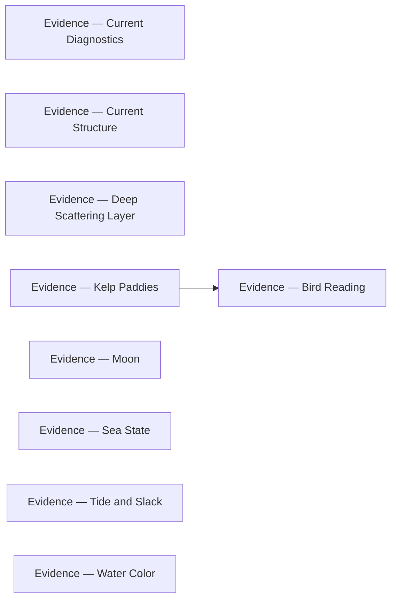

# Evidence

<!-- index:start -->
## Index

- [Evidence — Bird Reading](bird-reading.md) — Per-source provenance backing Bird Reading.
- [Evidence — Current Diagnostics](current-diagnostics.md) — Per-source provenance backing Current Diagnostics.
- [Evidence — Current Structure](current-structure.md) — Per-source provenance backing Current Structure.
- [Evidence — Deep Scattering Layer](deep-scattering-layer.md) — Per-source provenance backing Deep Scattering Layer.
- [Evidence — Kelp Paddies](kelp-paddies.md) — Per-source provenance backing Kelp Paddies.
- [Evidence — Moon](moon.md) — Per-source provenance backing Moon.
- [Evidence — Sea State](sea-state.md) — Per-source provenance backing Sea State.
- [Evidence — Tide and Slack](tide-and-slack.md) — Per-source provenance backing Tide and Slack.
- [Evidence — Water Color](water-color.md) — Per-source provenance backing Water Color.
<!-- index:end -->

<!-- mermaid:start -->
## Map

<!-- mermaid:end -->
