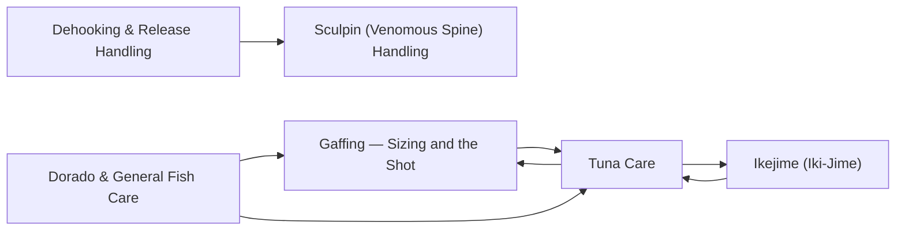

# Fish Care

<!-- index:start -->
## Index

- [Dehooking & Release Handling](dehooking-and-release.md) — Getting a hook out of a fish you intend to release, and measuring it, without doing the damage that makes the release pointless.
- [Dorado & General Fish Care](dorado-and-general.md) — Dorado get cared for differently from tuna — the priority is protecting their color and flesh, not bleeding — and the second half of this note collects the icin
- [Gaffing — Sizing and the Shot](gaffing.md) — The mechanics of putting a gaff into a fish and getting it aboard, across the species that get gaffed rather than netted in SoCal/Baja: yellowtail, dorado, Cali
- [Ikejime (Iki-Jime)](ikejime.md) — Ikejime is spiking the fish's brain to kill it instantly, the top tier of tuna care when quality is the goal.
- [Sculpin (Venomous Spine) Handling](sculpin-handling.md) — Sculpin — the reddish bottomfish anglers pull up on rockfish/bottom gear, commonly called "sculpin" on SoCal boats (California scorpionfish) — carry venomous sp
- [Tuna Care](tuna-care.md) — The tuna care chain, from the gaff shot that boats the fish to the slurry that holds its quality for the drive home.
<!-- index:end -->

<!-- mermaid:start -->
## Map

<!-- mermaid:end -->
