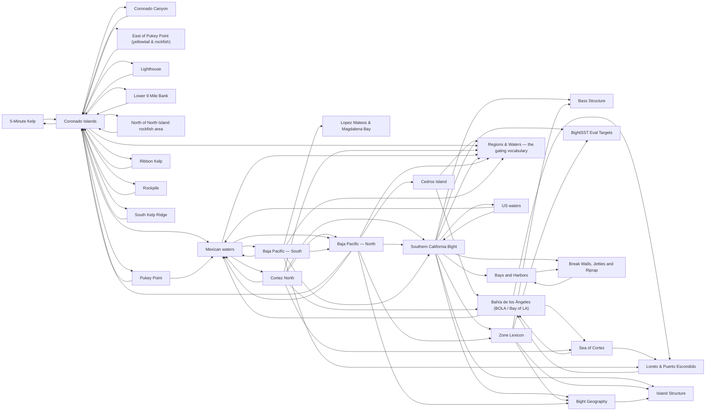

# Locations

<!-- index:start -->
## Index

- [5-Minute Kelp](5-minute-kelp.md) **[Baja only]** — A charted spot at 32°22.940'N 117°13.515'W (cameron), in the Coronado Islands zone.
- [Bahía de los Ángeles (BOLA / Bay of LA)](bahia-de-los-angeles.md) **[Baja only]** — A panga fishery on the Sea of Cortez side of northern Baja, ~8 hours' drive from San Diego, fished out of a hotel strip with day-boat operators.
- [Lopez Mateos & Magdalena Bay](bahia-magdalena-lopez-mateos.md) **[Baja only]** — Baja California Sur, Pacific side — a mangrove-and-bay complex with four distinct fisheries inside one bay.
- [Baja Pacific — North](baja-pacific-north.md) **[Baja only]** — The character rung.
- [Baja Pacific — South](baja-pacific-south.md) **[Baja only]** — The character rung.
- [Bass Structure](bass-structure.md) **[SoCal only]** — How to break down the kelp, reef, and hard-bottom structure that calico bass and sand bass live on — reading it and setting up on it.
- [Bays and Harbors](bays-and-harbors.md) **[SoCal only]** — How a SoCal bay or harbor is laid out for fishing — the universal structure a new-to-SoCal angler should be able to name and read on any of them (San Diego Bay,
- [Bight Geography](bight-geography.md) **[SoCal only]** — The big-picture map of the Southern California Bight for planning: which zones the NW wind wrecks and which ride it out, the path the warm water band tracks thr
- [BightSST Eval Targets](bightsst-eval-targets.md) **[SoCal only]** — The named evaluation spots Cameron's BightSST platform uses to test its upwelling / turnover detection — a fixed, small set of locations the model is scored aga
- [Break Walls, Jetties and Riprap](breakwalls-jetties-riprap.md) **[SoCal only]** — Man-made rock structure — harbor break walls, jetties, and riprap channel edges — read as fishing structure.
- [Cedros Island](cedros-island.md) **[Baja only]** — [Baja only] — Isla de Cedros sits off the Pacific coast of Baja California at roughly 28°N, just inside the northern half of the Baja Pacific line.
- [Coronado Canyon](coronado-canyon.md) **[Baja only]** — A charted spot at 32°30.300'N 117°17.500'W (cameron), in the Coronado Islands zone.
- [Coronado Islands](coronado-islands.md) **[Baja only]** — A four-island chain roughly 13 nm off the San Diego bay entrance (cameron), and the closest island fishing to a major US port — which is why it is the springtim
- [Cortez North](cortez-north.md) **[Baja only]** — The character rung.
- [East of Pukey Point (yellowtail & rockfish)](east-of-pukey-point.md) **[Baja only]** — A charted spot at 32°27.000'N 117°14.100'W (cameron), in the Coronado Islands zone.
- [Island Structure](island-structure.md) **[SoCal only]** — Universal typology of SoCal island and bank structure — the shapes the bottom takes and how current has to run across each shape to make it fish.
- [Lighthouse](lighthouse.md) **[Baja only]** — A charted spot at 32°23.290'N 117°14.570'W (cameron), in the Coronado Islands zone.
- [Loreto & Puerto Escondido](loreto.md) **[Baja only]** — The southern Sea of Cortez island fishery — roughly 250 miles south of Bahía de los Ángeles, and a different mix of fish.
- [Lower 9 Mile Bank](lower-9-mile-bank.md) **[Baja only]** — A charted spot at 32°32.500'N 117°20.500'W (cameron), in the Coronado Islands zone.
- [Mexican waters](mexican-waters.md) — Everything south of the border needs paperwork a US angler does not carry by default, and the checks are real rather than theoretical.
- [North of North Island rockfish area](north-of-north-island-rockfish-area.md) **[Baja only]** — A charted spot at 32°27.380'N 117°18.000'W (cameron), in the Coronado Islands zone.
- [Pukey Point](pukey-point.md) **[Baja only]** — The northern end of the Coronado Islands chain, at 32°26.850'N 117°18.000'W (cameron).
- [Regions & Waters — the gating vocabulary](regions.md) **[SoCal only]** — The closed vocabulary every note tags itself with, so a day plan can never offer you a fish or a technique that doesn't exist where you're going.
- [Ribbon Kelp](ribbon-kelp.md) **[Baja only]** — A charted spot at 32°24.800'N 117°13.880'W (cameron), in the Coronado Islands zone.
- [Rockpile](rockpile.md) **[Baja only]** — A charted spot at 32°17.620'N 117°10.030'W (cameron), in the Coronado Islands zone.
- [Sea of Cortez](sea-of-cortez.md) **[Baja only]** — The Gulf side of Baja — a shallow-rock, structure-ambush fishery that plays like SoCal calico fishing scaled up.
- [Southern California Bight](socal-bight.md) **[SoCal only]** — The character rung.
- [South Kelp Ridge](south-kelp-ridge.md) **[Baja only]** — A charted spot at 32°22.000'N 117°13.260'W (cameron), in the Coronado Islands zone.
- [US waters](us-waters.md) — The paperwork rung.
- [Zone Lexicon](zone-lexicon.md) **[SoCal only]** — The vocabulary of SoCal fishing zones — how to name a spot, how to think about a spot as a *box* rather than a pin, and how big that box is.

### Subfolders
- [evidence/](evidence/README.md)
<!-- index:end -->

<!-- mermaid:start -->
## Map

<!-- mermaid:end -->
