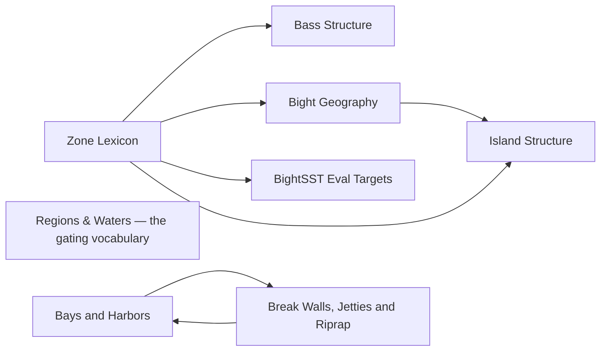

# Locations

<!-- index:start -->
## Index

- [Bass Structure](bass-structure.md) **[SoCal only]** — How to break down the kelp, reef, and hard-bottom structure that calico bass and sand bass live on — reading it and setting up on it.
- [Bays and Harbors](bays-and-harbors.md) **[SoCal only]** — How a SoCal bay or harbor is laid out for fishing — the universal structure a new-to-SoCal angler should be able to name and read on any of them (San Diego Bay,
- [Bight Geography](bight-geography.md) **[SoCal only]** — The big-picture map of the Southern California Bight for planning: which zones the NW wind wrecks and which ride it out, the path the warm water band tracks thr
- [BightSST Eval Targets](bightsst-eval-targets.md) **[SoCal only]** — The named evaluation spots Cameron's BightSST platform uses to test its upwelling / turnover detection — a fixed, small set of locations the model is scored aga
- [Break Walls, Jetties and Riprap](breakwalls-jetties-riprap.md) **[SoCal only]** — Man-made rock structure — harbor break walls, jetties, and riprap channel edges — read as fishing structure.
- [Island Structure](island-structure.md) **[SoCal only]** — Universal typology of SoCal island and bank structure — the shapes the bottom takes and how current has to run across each shape to make it fish.
- [Regions & Waters — the gating vocabulary](regions.md) **[SoCal only]** — The closed vocabulary every note tags itself with, so a day plan can never offer you a fish or a technique that doesn't exist where you're going.
- [Zone Lexicon](zone-lexicon.md) **[SoCal only]** — The vocabulary of SoCal fishing zones — how to name a spot, how to think about a spot as a *box* rather than a pin, and how big that box is.
<!-- index:end -->

<!-- mermaid:start -->
## Map

<!-- mermaid:end -->
