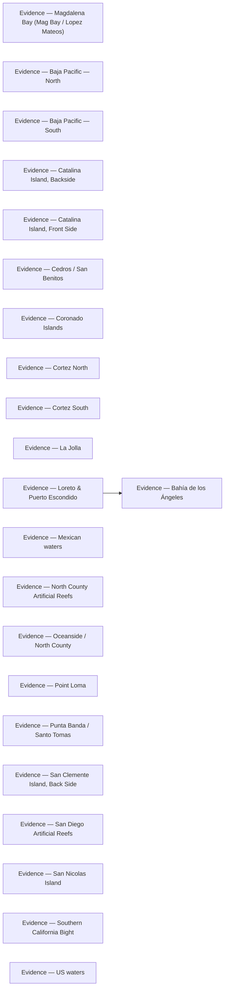

# Evidence

<!-- index:start -->
## Index

- [Evidence — Bahía de los Ángeles](bahia-de-los-angeles.md) — The observation layer behind Bahía de los Ángeles.
- [Evidence — Magdalena Bay (Mag Bay / Lopez Mateos)](bahia-magdalena-lopez-mateos.md) — The observation layer behind Magdalena Bay.
- [Evidence — Baja Pacific — North](baja-pacific-north.md) — The observation layer behind Baja Pacific — North.
- [Evidence — Baja Pacific — South](baja-pacific-south.md) — The observation layer behind Baja Pacific — South.
- [Evidence — Catalina Island, Backside](catalina-island-backside.md) — The observation layer behind Catalina Island — Backside.
- [Evidence — Catalina Island, Front Side](catalina-island-front-side.md) — The observation layer behind Catalina Island — Front Side.
- [Evidence — Cedros / San Benitos](cedros-island.md) — The observation layer behind Cedros / San Benitos.
- [Evidence — Coronado Islands](coronado-islands.md) — The observation layer behind Coronado Islands.
- [Evidence — Cortez North](cortez-north.md) — The observation layer behind Cortez North.
- [Evidence — Cortez South](cortez-south.md) — The observation layer behind Cortez South.
- [Evidence — La Jolla](la-jolla.md) — The observation layer behind La Jolla.
- [Evidence — Loreto & Puerto Escondido](loreto.md) — The observation layer behind Loreto & Puerto Escondido.
- [Evidence — Mexican waters](mexican-waters.md) — The observation layer behind Mexican waters.
- [Evidence — North County Artificial Reefs](north-county-artificial-reefs.md) — The observation layer behind North County Artificial Reefs.
- [Evidence — Oceanside / North County](oceanside-north-county.md) — The observation layer behind Oceanside / North County.
- [Evidence — Point Loma](point-loma.md) — The observation layer behind Point Loma.
- [Evidence — Punta Banda / Santo Tomas](punta-banda-santo-tomas.md) — The observation layer behind Punta Banda / Santo Tomas.
- [Evidence — San Clemente Island, Back Side](san-clemente-island-back-side.md) — The observation layer behind San Clemente Island — Back Side.
- [Evidence — San Diego Artificial Reefs](san-diego-artificial-reefs.md) — The observation layer behind San Diego Artificial Reefs.
- [Evidence — San Nicolas Island](san-nicolas-island.md) — The observation layer behind San Nicolas Island.
- [Evidence — Southern California Bight](socal-bight.md) — The observation layer behind Southern California Bight.
- [Evidence — US waters](us-waters.md) — The observation layer behind US waters.
<!-- index:end -->

<!-- mermaid:start -->
## Map

<!-- mermaid:end -->
