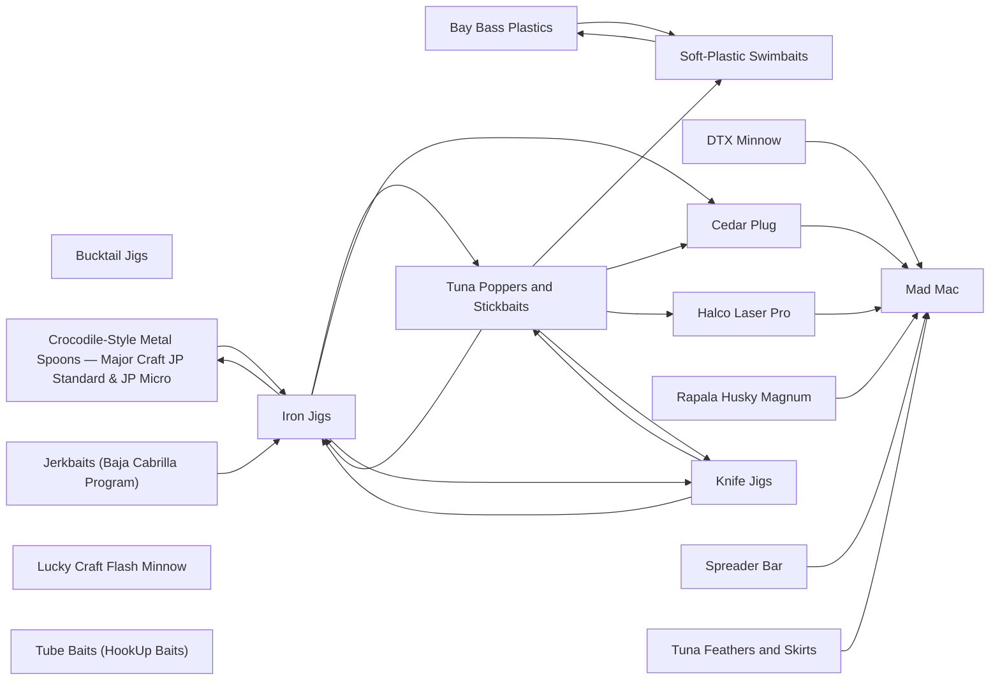

# Lures

<!-- index:start -->
## Index

- [Bay Bass Plastics](bay-bass-plastics.md) **[SoCal only]** — The small finesse soft-plastics class for the back bays: little scented sticks, flukes, worms, and grubs fished slow and low for spotted bay bass (spotties) and
- [Bucktail Jigs](bucktail-jigs.md) **[Baja only]** — A bucktail is a leadhead jig dressed with hair instead of plastic, fished on a cast and worked up off the bottom rather than swum at a steady speed.
- [Cedar Plug](cedar-plug.md) **[SoCal only]** — The cedar plug is a plain weighted-nose wood cylinder — no bib, no rattle — that has caught tuna in SoCal/Baja for generations.
- [Crocodile-Style Metal Spoons — Major Craft JP Standard & JP Micro](crocodile-spoons.md) — The crocodile is a traditional cast-and-retrieve metal spoon shape, long fished by SoCal anglers generally (M4G8IKsZEFU) — the same broad family as the Krocodil
- [DTX Minnow](dtx-minnow.md) **[SoCal only]** — The Nomad DTX Minnow is a mid-depth trolling swimmer that gets down and holds a tight action across a wide speed band — a swimmer whose action dies on heavy lin
- [Halco Laser Pro](halco-laser-pro.md) **[SoCal only]** — The Halco Laser Pro is a bibbed trolling minnow — the deep-diving XDD bib version dives hard for its size.
- [Iron Jigs](iron-jigs.md) — The iron is SoCal's signature cast-and-retrieve metal: a chrome or painted elongated slab, hookless-drop or single-hook, that swims with a side-to-side kick on
- [Jerkbaits (Baja Cabrilla Program)](jerkbaits.md) **[Baja only]** — Slender minnow-profile hardbaits burned fast on a cast-and-wind retrieve for cabrilla (leopard grouper) working shoreline rock and submerged structure in the Se
- [Knife Jigs](knife-jigs.md) — The vertical metal jig class: a dense metal jig dropped straight down and worked in the water column, split by cross-section and how it falls.
- [Lucky Craft Flash Minnow](lucky-craft-flash-minnow.md) **[SoCal only]** — A 110 mm shallow-diving hardbait, and the generic term SoCal surf anglers use for any minnow-type lure in this class: "if you call it a Lucky Craft to a surf an
- [Mad Mac](mad-mac.md) — The Nomad Madmacs is a hard-tracking, high-speed sinking minnow — the canonical SoCal bluefin speed-troll lure.
- [Rapala Husky Magnum](rapala-husky-magnum.md) — The Rapala Husky Magnum is a bibbed trolling minnow whose model number is its running depth at a standard setback — pick the number, get the depth.
- [Soft-Plastic Swimbaits](soft-plastic-swimbaits.md) — The saltwater soft-plastic swimbait / slug class for kelp and reef bass: a paddle-tail or boot-tail plastic (or a tailless slug) rigged on a hook so it runs cle
- [Spreader Bar](spreader-bar.md) — A spreader bar is a rigid horizontal bar carrying a teaser school of hookless squids or birds with one stinger lure trailing on the center line — it presents as
- [Tube Baits (HookUp Baits)](tube-baits.md) — A tube bait is a soft plastic with the lead head molded inside the body — head inside the plastic, not a bare jig head threaded with a plastic trailer (cameron).
- [Tuna Feathers and Skirts](tuna-feathers-and-skirts.md) **[SoCal only]** — Feathers and soft skirts are the West Coast trolling staple — a weighted or bullet head trailing a skirt over a hook, presenting as a small squid or baitfish.
- [Tuna Poppers and Stickbaits](tuna-poppers-and-stickbaits.md) — The SoCal tuna surface-plug class: hard baits you cast into breaking tuna and work on top.

### Subfolders
- [evidence/](evidence/README.md)
<!-- index:end -->

<!-- mermaid:start -->
## Map

<!-- mermaid:end -->
