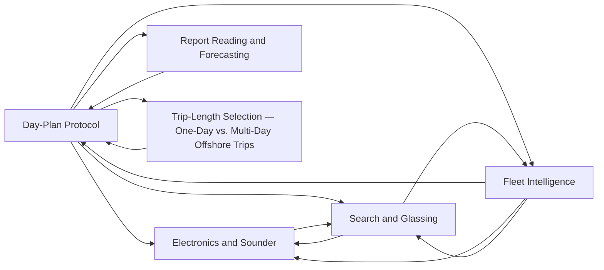

# Planning

<!-- index:start -->
## Index

- [Day-Plan Protocol](day-plan-protocol.md) — The procedure chat and the boat-day skill follow to turn conditions + priors into a gear'd-up plan.
- [Electronics and Sounder](electronics-and-sounder.md) — How to use the sounder and radar to find fish and decide whether to stop.
- [Fleet Intelligence](fleet-intelligence.md) — How to treat what the rest of the fleet is doing — VHF chatter and AIS/vessel tracking — as a planning input, and why the two are not equally trustworthy.
- [Report Reading and Forecasting](report-reading-and-forecasting.md) — How to age, discount, and project fishing reports into a plan.
- [Search and Glassing](search-and-glassing.md) — How to actually look for offshore fish, and how to anchor once you find the water.
- [Trip-Length Selection — One-Day vs. Multi-Day Offshore Trips](trip-length-selection.md) — Which multi-day trip length to book is a boat-operator call made before conditions, species, and gear resolve — it sits upstream of the day-plan protocol.

### Subfolders
- [evidence/](evidence/README.md)
<!-- index:end -->

<!-- mermaid:start -->
## Map

<!-- mermaid:end -->
