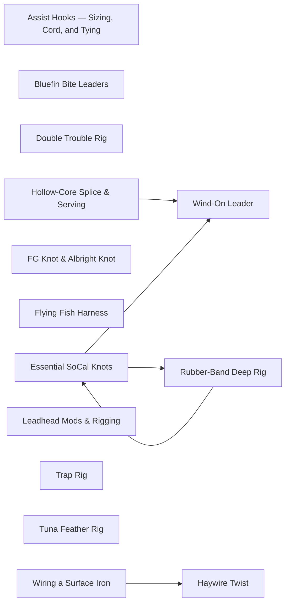

# Rigging

<!-- index:start -->
## Index

- [Assist Hooks — Sizing, Cord, and Tying](assist-hooks.md) **[SoCal only]** — How to build and resize an assist hook trackside or on the water: matching hook size to a jig, choosing cord stiffness for the jig style, and tying a single (to
- [Bluefin Bite Leaders](bite-leaders.md) **[SoCal only]** — A bite leader is a short, heavy fluorocarbon section crimped between the main line and the jig — described as the most critical part of a bluefin knife-jig setu
- [Double Trouble Rig](double-trouble-rig.md) **[SoCal only]** — A two-bait live-bait presentation hung from the kite and run off two rods — similar in the water to flying a kite bait, but with two live baits instead of a fly
- [Essential SoCal Knots](essential-knots.md) **[SoCal only]** — The short list of knots that cover a SoCal sport-boat or private-boat day: terminal knots that tie line to a hook or lure (Palomar, San Diego jam, loop knot), a
- [FG Knot & Albright Knot](fg-and-albright.md) **[SoCal only]** — Two braid-to-leader connection knots that solve different problems.
- [Flying Fish Harness](flying-fish-harness.md) — The pre-rigged flying fish (dead natural, netted or sabiki-caught, or an artificial) used off the kite for large local Pacific bluefin.
- [Haywire Twist](haywire-twist.md) — The connection used to terminate single-strand wire leader — to a lure or a hook — for toothy fish that cut through even heavy mono.
- [Hollow-Core Splice & Serving](hollow-splice-and-serving.md) **[SoCal only]** — Two knotless connections made possible by hollow-core braid, both relying on the same finger-trap principle: braid woven around a buried line clamps tighter as
- [Leadhead Mods & Rigging](leadhead-mods.md) **[SoCal only]** — The leadhead (jig head) is a workhorse for seabass, halibut, yellowtail, bass, and rockfish.
- [Rubber-Band Deep Rig](rubber-band-deep-rig.md) **[SoCal only]** — A way to take an otherwise flylined live bait down to tuna that are holding deep or sounded on the meter: a torpedo sinker is fastened to the line with a rubber
- [Trap Rig](trap-rig.md) — A two-hook live-bait rig for halibut: a J hook up front with an additional stinger hook trailing behind.
- [Tuna Feather Rig](tuna-feather-rig.md) **[SoCal only]** — Rigging a tuna feather — a West Coast trolling staple.
- [Wind-On Leader](wind-on-leader.md) **[SoCal only]** — A wind-on leader is a fluorocarbon (or mono) top shot joined to hollow-core braid without a knot: the leader is threaded *inside* the hollow braid so the braid'
- [Wiring a Surface Iron](wiring-a-surface-iron.md) — A short single-strand wire link between the ring/clip and the nose of the iron, in place of tying the line straight to the jig.
<!-- index:end -->

<!-- mermaid:start -->
## Map

<!-- mermaid:end -->
