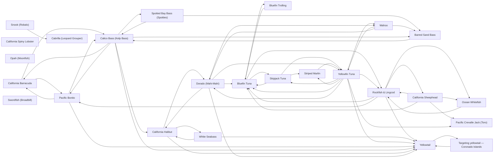

# Species

<!-- index:start -->
## Index

- [California Barracuda](barracuda.md) — Barracuda are the toothy member of the SoCal "three B's" — bass, barracuda, bonito — taken off the same kelp lines, boiler rocks and beach edges that hold calic
- [Bluefin Trolling](bluefin-trolling.md) **[SoCal only]** — Which trolled or towed presentation to pull for SoCal bluefin, and when.
- [Bluefin Tuna](bluefin-tuna.md) — Pacific bluefin run sub-30 lb schoolies to 300 lb+ cows in the same season off SoCal and northern Baja, and grade is unpredictable trip to trip — which is why b
- [Pacific Bonito](bonito.md) — Bonito are the fast, small-grade member of the SoCal "three B's" — bass, barracuda, bonito — taken in packs that boil outside the kelp and over the offshore ban
- [Cabrilla (Leopard Grouper)](cabrilla.md) **[Baja only]** — Region: Baja — Sea of Cortez / Bay of LA (BOLA), panga fishery.
- [Calico Bass (Kelp Bass)](calico-bass.md) — The signature SoCal inshore ambush predator: a kelp- and reef-dweller that sits on a defined structure edge and eats what the current sweeps past it.
- [California Halibut](california-halibut.md) — A flatfish you catch by out-thinking the sand, not by covering it.
- [California Spiny Lobster](california-spiny-lobster.md) **[SoCal only]** — SoCal's "bug" fishery — caught recreationally by hoop netting rocky structure and kelp edges at night during the fall–winter season.
- [Dorado (Mahi-Mahi)](dorado.md) — SoCal/Baja dorado are a warm-water, structure-oriented offshore fish: they ride the green-cold / blue-warm boundary and stack on kelp paddies and open-water sch
- [Ocean Whitefish](ocean-whitefish.md) — The ocean whitefish (*Caulolatilus princeps*) is a tilefish, not a rockfish — a distinct, highly underrated table fish that schools over hard bottom and sand ed
- [Opah (Moonfish)](opah.md) **[SoCal only]** — Opah — a large, round-bodied, warm-blooded pelagic — show up in the SoCal long-range fishery as an incidental catch rather than a dedicated target: boats pick t
- [Pacific Crevalle Jack (Toro)](pacific-crevalle-jack.md) — The Pacific crevalle jack (*Caranx caninus*, "toro") is a warm-water, inshore structure gamefish — common in Baja (Sea of Cortez, BOLA, farther south) and a rar
- [Rockfish & Lingcod](rockfish-lingcod.md) — The deep-structure bottomfish complex: reds/vermilion, bocaccio ("salmon grouper"), blue (Johnny) bass, coppers and the rest of the rockfish family, plus lingco
- [Barred Sand Bass](sand-bass.md) — The sand-flat and deep-structure cousin of the calico: a bottom-associated bass that lives on and around hard bottom, wrecks, and the reef-to-sand transition an
- [California Sheephead](sheephead.md) — The California sheephead (*Semicossyphus pulcher*) is a year-round SoCal structure resident — a reliable, table-quality target that lives on reefs and hard stru
- [Skipjack Tuna](skipjack-tuna.md) — The ubiquitous warm-water tuna of the SoCal/Baja offshore — "skippies" are almost always the first and most aggressive fish to a chum line or a burning cast, wh
- [Snook (Robalo)](snook.md) **[Baja only]** — Single-location, single-source note: Lopez Mateos / Magdalena Bay, Baja California Sur.
- [Spotted Bay Bass (Spotties)](spotted-bay-bass.md) **[SoCal only]** — The bay-and-harbor bass — a light-line, structure-relating fish you catch on eelgrass edges, mooring cans, dock pilings, riprap, and channel drops inside San Di
- [Striped Marlin](striped-marlin.md) — SoCal striped marlin are a fall sight-and-troll billfishery: slow-troll lures/skirts through clean blue water off a bait/color edge, tease fish up, and switch t
- [Swordfish (Broadbill)](swordfish.md) **[SoCal only]** — SoCal daytime deep-drop swordfish: find deep contour structure where the deep scattering layer holds bait, then present a dead bait in/below the layer and let t
- [Wahoo](wahoo.md) — A fast, toothy, warm-water pelagic — SoCal/Baja anglers reach for it mostly as part of a mixed offshore troll (tuna/dorado/marlin) or on a dedicated trip to kno
- [White Seabass](white-seabass.md) — The premier SoCal inshore gamefish, and one of the most pattern-driven: white seabass bites cluster on the moons, fire on the slack tide, and require a specific
- [Yellowfin Tuna](yellowfin-tuna.md) — SoCal's summer-into-fall bread-and-butter tuna — 8–10 lb up to 40–50 lb, with 15–25 lb the average grade.
- [Targeting yellowtail — Coronado Islands](yellowtail-coronado-islands.md) **[Baja only]** — The Coronados are the springtime yellowtail trip on San Diego's doorstep: an island chain roughly 13 mi out, off the coast of Mexico, whose west side is exposed
- [Yellowtail](yellowtail.md) — Yellowtail show three faces: boiling/breezing surface fish, paddy yellows traveling under offshore kelp, and bottom fish stacked on pinnacles and high spots.

### Subfolders
- [evidence/](evidence/README.md)
<!-- index:end -->

<!-- mermaid:start -->
## Map

<!-- mermaid:end -->
