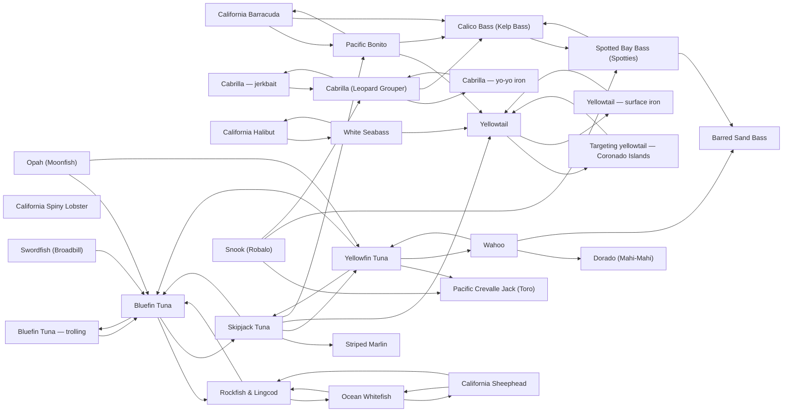

# Species

<!-- index:start -->
## Index

- [California Barracuda](barracuda.md) — Barracuda are the toothy member of the SoCal "three B's" — bass, barracuda, bonito — taken off the same kelp lines, boiler rocks and beach edges that hold calic
- [Bluefin Tuna — trolling](bluefin-tuna-trolling.md) **[SoCal only]** — Which towed presentation to pull for SoCal bluefin, and when.
- [Bluefin Tuna](bluefin-tuna.md) — Pacific bluefin run sub-30 lb schoolies to 300 lb+ cows in the same season off SoCal and northern Baja, and grade is unpredictable trip to trip — which is why b
- [Pacific Bonito](bonito.md) — Bonito are the fast, small-grade member of the SoCal "three B's" — bass, barracuda, bonito — taken in packs that boil outside the kelp and over the offshore ban
- [Cabrilla — jerkbait](cabrilla-jerkbait.md) **[Baja only]** — A slender minnow-profile hardbait burned fast at rock is the cabrilla program's default tool, and the light on the water — not the calendar — sets the size fish
- [Cabrilla — yo-yo iron](cabrilla-yo-yo-iron.md) **[Baja only]** — Once the sun is up and cabrilla have backed off the shallow rock, the iron takes the day over from the jerkbait — but it is fished as a cast-and-burn, not as a
- [Cabrilla (Leopard Grouper)](cabrilla.md) **[Baja only]** — Cabrilla is the leopard grouper of the Sea of Cortez (dEPuDrhoClM), fished from pangas as a cast-and-burn program: the fish sits on rock and is pulled off it by
- [Calico Bass (Kelp Bass)](calico-bass.md) — Calico bass sit on a defined structure edge — kelp, reef, boiler rock, breakwall — and eat what the current sweeps past them, so a coastal bass day is planned o
- [California Halibut](california-halibut.md) — California halibut lie in the sand within 5–20 ft of a hard edge, flip sand over their backs and ambush bait the current pins against that edge, so the search i
- [California Spiny Lobster](california-spiny-lobster.md) **[SoCal only]** — Spiny lobster is the one target in this KB with no rod-and-reel route: the recreational program is baited hoop nets on rock, riprap and kelp edge, worked after
- [Dorado (Mahi-Mahi)](dorado.md) — Dorado concentrate where the cold green coastal water butts against the warm blue water offshore — 71.6 °F on a productive paddy — and stack under the broken-of
- [Ocean Whitefish](ocean-whitefish.md) — The ocean whitefish (*Caulolatilus princeps*) is a tilefish, not a rockfish, and it fishes as a school over hard bottom and sand-edge transitions: at the Channe
- [Opah (Moonfish)](opah.md) **[SoCal only]** — Opah are a bycatch of the SoCal offshore tuna program, not a target: they eat a jig or a sinker-weighted bait fished 150–200 ft down while the boat drifts, and
- [Pacific Crevalle Jack (Toro)](pacific-crevalle-jack.md) — The Pacific crevalle jack (*Caranx caninus*, "toro") is an inshore jack of the warm Baja coast that turns up inside somebody else's mixed-bag day rather than as
- [Rockfish & Lingcod](rockfish-lingcod.md) — Reds/vermilion, bocaccio ("salmon grouper"), blue (Johnny) bass, coppers and the rest of the rockfish family, plus lingcod as the apex predator on the same high
- [Barred Sand Bass](sand-bass.md) — Barred sand bass are structure-oriented but not locked to the bottom the way a lingcod or cabezon is — they hover slightly above or within the reef, wreck or ke
- [California Sheephead](sheephead.md) — California sheephead (*Semicossyphus pulcher*) live on SoCal reefs and hard structure "every single day," which makes them the target once the water cools and t
- [Skipjack Tuna](skipjack-tuna.md) — Skipjack — "skippies" — are the fish that reaches the offering first on the SoCal/Baja tuna grounds: they pile into a chum line laid for yellowfin (lxFNVdDhMy4)
- [Snook (Robalo)](snook.md) **[Baja only]** — The corpus documents snook in exactly one fishery — Magdalena Bay / Lopez Mateos, Baja California Sur — and it is two programs, not one.
- [Spotted Bay Bass (Spotties)](spotted-bay-bass.md) **[SoCal only]** — Spotted bay bass are the bay-and-harbor fishery that runs on the tide clock: the fish hold ambush stations keyed to which way the water is moving, so a spot tha
- [Striped Marlin](striped-marlin.md) — Striped marlin are the SoCal island zone's late-summer-into-fall sight-and-troll billfishery: a short, tight lure spread pulled along the clean side of a bait/c
- [Swordfish (Broadbill)](swordfish.md) **[SoCal only]** — SoCal broadbill are a daytime deep-drop fishery built on one fact: the fish ride the deep scattering layer by day, so you hunt the layer and its bait over deep
- [Wahoo](wahoo.md) — Water temperature is the gate on wahoo, not the calendar: 72 °F or warmer is the standing condition for a chance at one, and fall — late September, October, ear
- [White Seabass](white-seabass.md) — White seabass is a squid fishery before it is a seabass fishery: the fish sit on island squid beds in 60–90 ft, close to the bottom, eating spawning squid that
- [Yellowfin Tuna](yellowfin-tuna.md) — SoCal's summer-into-fall bread-and-butter tuna: 8–10 lb up to 40–50 lb, with 15–25 lb the average grade (8M4QhL-Qb7E).
- [Targeting yellowtail — Coronado Islands](yellowtail-coronado-islands.md) **[Baja only]** — The Coronados are the springtime yellowtail trip on San Diego's doorstep: an island chain roughly 13 mi out, off the coast of Mexico, whose west side is exposed
- [Yellowtail — surface iron](yellowtail-surface-iron.md) — The long rod and a Tady 45 or Salas 7X is the first outfit off the rack when yellowtail show on top, and the reason is reach: it puts a big profile on fish that
- [Yellowtail](yellowtail.md) — Yellowtail show three faces: boiling/breezing surface fish, paddy yellows traveling under offshore kelp, and bottom fish stacked on pinnacles and high spots.

### Subfolders
- [evidence/](evidence/README.md)
<!-- index:end -->

<!-- mermaid:start -->
## Map

<!-- mermaid:end -->
