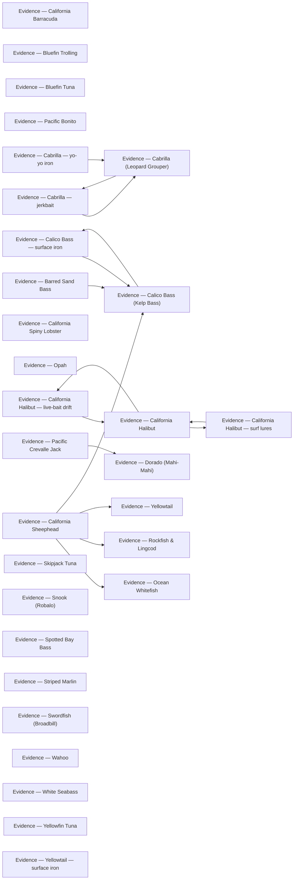

# Evidence

<!-- index:start -->
## Index

- [Evidence — California Barracuda](barracuda.md) — Trip reports and per-source provenance backing California barracuda.
- [Evidence — Bluefin Trolling](bluefin-tuna-trolling.md) — Trip reports and per-source provenance backing bluefin trolling.
- [Evidence — Bluefin Tuna](bluefin-tuna.md) — Trip reports and per-source provenance backing bluefin tuna.
- [Evidence — Pacific Bonito](bonito.md) — Trip reports and per-source provenance backing Pacific bonito.
- [Evidence — Cabrilla — jerkbait](cabrilla-jerkbait.md) — Trip reports and per-source provenance backing cabrilla — jerkbait.
- [Evidence — Cabrilla — yo-yo iron](cabrilla-yo-yo-iron.md) — Trip reports and per-source provenance backing cabrilla — yo-yo iron.
- [Evidence — Cabrilla (Leopard Grouper)](cabrilla.md) — Trip reports and per-source provenance backing cabrilla.
- [Evidence — Calico Bass — surface iron](calico-bass-surface-iron.md) — Trip reports and per-source provenance backing calico bass — surface iron.
- [Evidence — Calico Bass (Kelp Bass)](calico-bass.md) — Trip reports and per-source provenance backing calico bass.
- [Evidence — California Halibut — live-bait drift](california-halibut-live-bait-drift.md) — Trip reports and per-source provenance backing California halibut — live-bait drift.
- [Evidence — California Halibut — surf lures](california-halibut-surf-lures.md) — Trip reports and per-source provenance backing California halibut — surf lures.
- [Evidence — California Halibut](california-halibut.md) — Trip reports and per-source provenance backing California halibut.
- [Evidence — California Spiny Lobster](california-spiny-lobster.md) — Trip reports and per-source provenance backing California spiny lobster.
- [Evidence — Dorado (Mahi-Mahi)](dorado.md) — Trip reports and per-source provenance backing dorado.
- [Evidence — Ocean Whitefish](ocean-whitefish.md) — Trip reports and per-source provenance backing ocean whitefish.
- [Evidence — Opah](opah.md) — Per-source provenance backing opah.
- [Evidence — Pacific Crevalle Jack](pacific-crevalle-jack.md) — Per-source provenance backing Pacific crevalle jack.
- [Evidence — Rockfish & Lingcod](rockfish-lingcod.md) — Trip reports and per-source provenance backing rockfish & lingcod.
- [Evidence — Barred Sand Bass](sand-bass.md) — Trip reports and per-source provenance backing sand bass.
- [Evidence — California Sheephead](sheephead.md) — Trip reports and per-source provenance backing California sheephead.
- [Evidence — Skipjack Tuna](skipjack-tuna.md) — Per-source provenance backing skipjack tuna.
- [Evidence — Snook (Robalo)](snook.md) — Per-source provenance backing snook.
- [Evidence — Spotted Bay Bass](spotted-bay-bass.md) — Trip reports and per-source provenance backing spotted bay bass.
- [Evidence — Striped Marlin](striped-marlin.md) — Per-source provenance backing striped marlin.
- [Evidence — Swordfish (Broadbill)](swordfish.md) — Per-source provenance backing swordfish.
- [Evidence — Wahoo](wahoo.md) — Per-source provenance backing wahoo.
- [Evidence — White Seabass](white-seabass.md) — Per-source provenance backing white seabass.
- [Evidence — Yellowfin Tuna](yellowfin-tuna.md) — Per-source provenance backing yellowfin tuna.
- [Evidence — Yellowtail — surface iron](yellowtail-surface-iron.md) — The observation layer behind yellowtail — surface iron.
- [Evidence — Yellowtail](yellowtail.md) — Trip reports and per-source provenance backing yellowtail.
<!-- index:end -->

<!-- mermaid:start -->
## Map

<!-- mermaid:end -->
