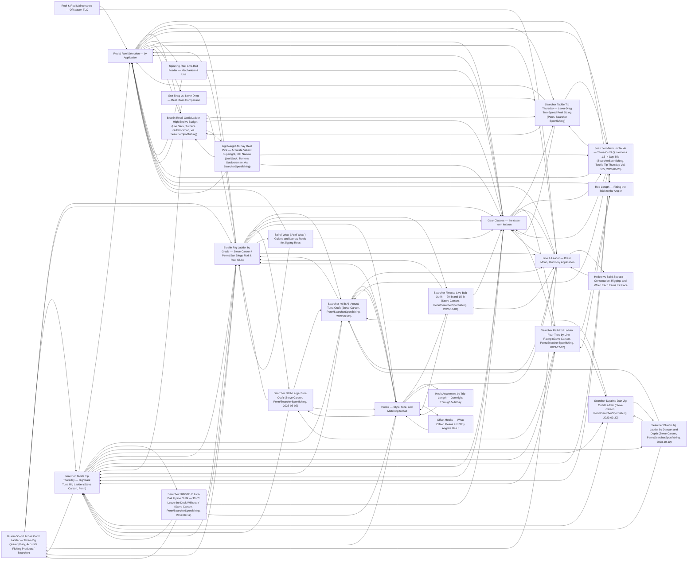

# Tackle

<!-- index:start -->
## Index

- [Bluefin 50–80 lb Bait Outfit Ladder — Three-Rig Quiver (Gary, Accurate Fishing Products / Searcher)](bluefin-50-80lb-bait-outfit-ladder.md) — Gary, presenter for Accurate Fishing Products, aboard the Searcher (SearcherSportfishing, "Tackle Tip Thursday Vol.
- [Bluefin Retail Outfit Ladder — High-End vs Budget (Lori Sack, Turner's Outdoorsman, via SearcherSportfishing)](bluefin-retail-setup-high-end-vs-budget.md) — Lori Sack, a tackle sales associate at Turner's Outdoorsman's San Marcos store, in a short segment on the SearcherSportfishing channel ("Tackle Tip Thursday Vol.
- [Bluefin Rig Ladder by Grade — Steve Carson / Penn (San Diego Rod & Reel Club)](bluefin-rig-ladder-by-grade.md) — Steve Carson (Penn), guest speaker at the San Diego Rod and Reel Club's November 2023 meeting — "5 must-have rod and reel setups for bluefin tuna fishing" (9JnI
- [Gear Classes — the class-term lexicon](gear-classes.md) — The KB describes gear in class terms (jig-stick class, 40–60 lb class, 200g-knife-jig class) so a species/technique note can say "reach for the surface-iron cla
- [Hook Assortment by Trip Length — Overnight Through 5–6 Day](hook-assortment-by-trip-length.md) — A minimal hook box, sized by species and bait rather than by a long shopping list — one boat's answer to "what do I actually need to pack" (Carl, Fisherman's La
- [Hooks — Style, Size, and Matching to Bait](hooks.md) — A hook is chosen on four axes: style (how it sets), size (matched to the bait, then the fish), wire gauge (how much it burdens a live bait vs.
- [Spiral-Wrap ("Acid-Wrap") Guides and Narrow Reels for Jigging Rods](jigging-rod-guide-wrap.md) — How a jigging rod's guide train is built, and how wide its paired reel's spool is, both feed the same goal — keeping the line (and the jig) vertical and under c
- [Lightweight All-Day Reel Pick — Accurate Valiant Superlight, 500 Narrow (Lori Sack, Turner's Outdoorsman, via SearcherSportfishing)](lightweight-reel-pick-turners-outdoorsman.md) — Lori Sack, a tackle sales associate at Turner's Outdoorsman, in a short segment on the SearcherSportfishing channel ("Tackle Tip Thursday Vol.
- [Line & Leader — Braid, Mono, Fluoro by Application](line-and-leader.md) — Three materials, three jobs.
- [Offset Hooks — What "Offset" Means and Why Anglers Use It](offset-hooks.md) — Spun out of hooks — this note is a single, narrow point that note's four-axis (style/size/wire-gauge/finish) framework doesn't cover: offset is a separate axis
- [Reel & Rod Maintenance — Offseason TLC](reel-maintenance.md) — Gear is a big investment; a rinse-and-store discipline is what makes it last.
- [Rod & Reel Selection — by Application](rod-and-reel-selection.md) — The right stick is decided by the application (what you're throwing and at what grade of fish), not by brand.
- [Rod Length — Fitting the Stick to the Angler](rod-length-for-angler-size.md) — Rod length isn't only an application variable (see the application table in rod & reel selection) — it also has to fit the angler holding it.
- [Searcher 30 lb Large-Tuna Outfit (Steve Carson, Penn/SearcherSportfishing, 2023-03-02)](searcher-30lb-large-tuna-outfit.md) — Steve Carson, aboard the Searcher (riEkdu8PEds, "Tackle Tip Thursday Vol.
- [Searcher 40 lb All-Around Tuna Outfit (Steve Carson, Penn/SearcherSportfishing, 2022-02-03)](searcher-40lb-all-around-tuna-outfit.md) — Steve Carson, aboard the Searcher (fyJA3o2hVh0, "Tackle Tip Thursday Vol.
- [Searcher 50/60/80 lb Live-Bait Flyline Outfit — "Don't Leave the Dock Without It" (Steve Carson, Penn/SearcherSportfishing, 2019-09-12)](searcher-50-60-80lb-flyline-outfit.md) — Steve Carson, aboard the Searcher (k4U3ETqmlEc, "Tackle Tip Thursday Vol.65 (Must-have Outfit)," uploaded 2019-09-12 — a 72-second segment).
- [Searcher Tackle Tip Thursday — Big/Giant Tuna Rig Ladder (Steve Carson, Penn)](searcher-big-tuna-rig-ladder.md) — Entries from Penn's own "Tackle Tip Thursday" series, filmed aboard the Searcher (SearcherSportfishing channel) and presented by Penn's Steve Carson.
- [Searcher Bluefin Jig Ladder by Daypart and Depth (Steve Carson, Penn/SearcherSportfishing, 2023-10-12)](searcher-bluefin-jig-ladder-by-daypart-and-depth.md) — Steve Carson, aboard the Searcher (vVOkxHx58Eg, "Tackle Tip Thursday Vol.
- [Searcher Daytime Dart-Jig Outfit Ladder (Steve Carson, Penn/SearcherSportfishing, 2023-03-30)](searcher-daytime-dart-jig-outfit-ladder.md) — Steve Carson, aboard the Searcher (pCd6QykcZ0w, "Tackle Tip Thursday Vol.
- [Searcher Finesse Live-Bait Outfit — 20 lb and 15 lb (Steve Carson, Penn/SearcherSportfishing, 2020-10-01)](searcher-finesse-live-bait-outfit.md) — Steve Carson, aboard the Searcher (ptoIvB2MspE, "Tackle Tip Thursday Vol.
- [Searcher Tackle Tip Thursday — Lever-Drag Two-Speed Reel Sizing (Penn, Searcher Sportfishing)](searcher-lever-drag-reel-sizing.md) — SearcherSportfishing, "Tackle Tip Thursday Vol.
- [Searcher Rail-Rod Ladder — Four Tiers by Line Rating (Steve Carson, Penn/SearcherSportfishing, 2023-12-07)](searcher-rail-rod-ladder.md) — Steve Carson, aboard the Searcher (sjOJiR6_HJ4, "Tackle Tip Thursday Vol.
- [Searcher Minimum Tackle — Three-Outfit Quiver for a 1.5–4 Day Trip (SearcherSportfishing, Tackle Tip Thursday Vol. 105, 2020-06-25)](searcher-three-outfit-minimum-quiver.md) — SearcherSportfishing, "Tackle Tip Thursday Vol.
- [Hollow vs Solid Spectra — Construction, Rigging, and When Each Earns Its Place](spectra-hollow-vs-solid.md) — Spun out of line & leader — this note is the detail behind that note's "Braid construction" summary.
- [Spinning-Reel Live-Bait Feeder — Mechanism & Use](spinning-reel-bait-feeder.md) — A live-bait feeder (sometimes called a bait-runner feature) is a spinning reel option worth selecting for if you fish live bait often — see rod & reel selection
- [Star Drag vs. Lever Drag — Reel Class Comparison](star-drag-vs-lever-drag.md) — SearcherSportfishing, "Tackle Tip Thursday Vol.
<!-- index:end -->

<!-- mermaid:start -->
## Map

<!-- mermaid:end -->
