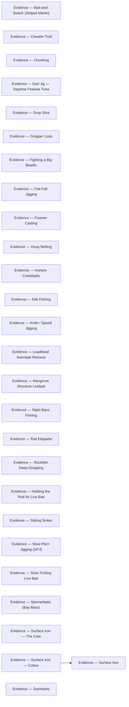

# Evidence

<!-- index:start -->
## Index

- [Evidence — Bait-and-Switch (Striped Marlin)](bait-and-switch.md) — Trip reports and per-source provenance backing bait-and-switch.
- [Evidence — Cheater Troll](cheater-troll.md) — Trip reports and per-source provenance backing cheater troll.
- [Evidence — Chunking](chunking.md) — Trip reports and per-source provenance backing chunking.
- [Evidence — Dart Jig — Daytime Finesse Tuna](dart-jig-tuna.md) — Per-source provenance backing dart jig — daytime finesse tuna.
- [Evidence — Drop Shot](drop-shot.md) — Trip reports and per-source provenance backing drop shot.
- [Evidence — Dropper Loop](dropper-loop.md) — Trip reports and per-source provenance backing dropper loop.
- [Evidence — Fighting a Big Bluefin](fighting-big-bluefin.md) — Trip reports and per-source provenance backing fighting a big bluefin.
- [Evidence — Flat-Fall Jigging](flat-fall-jigging.md) — Per-source provenance backing flat-fall jigging.
- [Evidence — Foamer Casting](foamer-casting.md) — Trip reports and per-source provenance backing foamer casting.
- [Evidence — Hoop Netting](hoop-netting.md) — Trip reports and per-source provenance backing hoop netting.
- [Evidence — Inshore Crankbaits](inshore-crankbaits.md) — Trip reports and per-source provenance backing inshore crankbaits.
- [Evidence — Kite Fishing](kite-fishing.md) — Trip reports and per-source provenance backing kite fishing.
- [Evidence — Knife / Speed Jigging](knife-jigging.md) — Per-source provenance backing knife/speed jigging.
- [Evidence — Leadhead Swimbait Retrieve](leadhead-swimbait-retrieve.md) — Per-source provenance backing leadhead swimbait retrieve.
- [Evidence — Mangrove Structure Livebait](mangrove-structure-livebait.md) — Per-source provenance backing mangrove structure livebait.
- [Evidence — Night Bass Fishing](night-bass-fishing.md) — Per-source provenance backing night bass fishing.
- [Evidence — Rail Etiquette](rail-etiquette.md) — Per-source provenance backing rail etiquette.
- [Evidence — Rockfish Deep-Dropping](rockfish-deep-dropping.md) — Per-source provenance backing rockfish deep-dropping.
- [Evidence — Holding the Rod for Live Bait](rod-handling-live-bait.md) — Per-source provenance backing holding the rod for live bait.
- [Evidence — Sliding Sinker](sliding-sinker.md) — Trip reports and per-source provenance backing sliding sinker.
- [Evidence — Slow-Pitch Jigging (SPJ)](slow-pitch-jigging.md) — Per-source provenance backing slow-pitch jigging.
- [Evidence — Slow-Trolling Live Bait](slow-trolling-bait.md) — Per-source provenance backing slow-trolling live bait.
- [Evidence — Spinnerbaits (Bay Bass)](spinnerbaits.md) — Per-source provenance backing spinnerbaits.
- [Evidence — Surface Iron — The Cast](surface-iron-casting.md) — Trip reports and per-source provenance backing surface iron — the cast.
- [Evidence — Surface Iron — Colour](surface-iron-color.md) — Trip reports and per-source provenance backing surface iron — colour.
- [Evidence — Surface Iron](surface-iron.md) — Trip reports and per-source provenance backing surface iron.
- [Evidence — Swimbaits](swimbaits.md) — Per-source provenance backing swimbaits.
<!-- index:end -->

<!-- mermaid:start -->
## Map

<!-- mermaid:end -->
